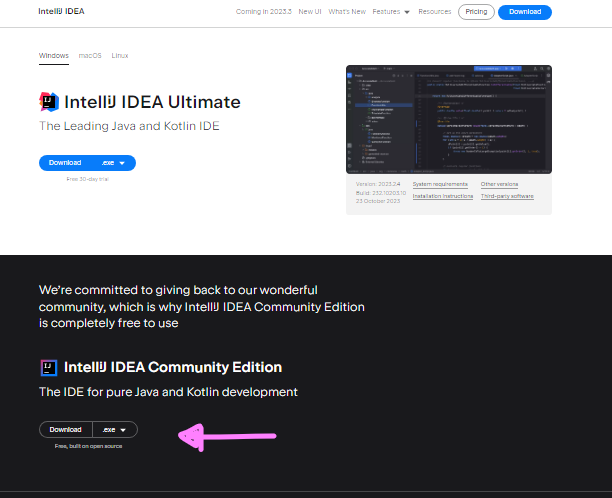
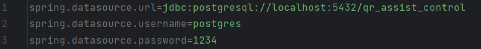
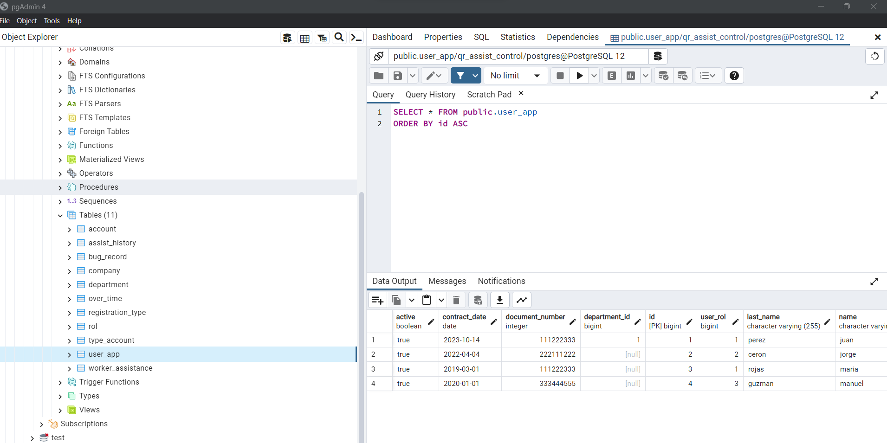

# Qr Assist Control

Clonar la branch `feat model class` o `stagging` en feat encontrarás la versión 
sin probar y probablemente con erroes, en satggin encontrarás los servicios
probados y funcionado al 100%.

## Te recomiendo instalar los siguientes programas:

1. [IntelliJ IDEA Community Edition](https://www.jetbrains.com/idea/download/?section=windows)

2. [Postgress](https://www.postgresql.org/) , solo la base de datos en el puerto 5432 con las credenciales :

con ese user y pass. Debes crear la base de datos, luego cuando levantes el back se crean las tablas automaticamente sin datos.
Si en la instalacion de postgress no viene con el cliente de la base de datos que en este caso es [PGAdmin4](https://www.pgadmin.org/download/pgadmin-4-windows/) te recomiendo instalarlo.

Se debería ver algo así. Para visualizar los datos te pone sobre la tabla , y en el segundo icono de la parte superior derecha,que parece una tabla , llamado view data podrás visualizar los datos una vez poblada las tablas.

3. [JDK 17](https://www.oracle.com/java/technologies/javase/jdk17-archive-downloads.html)

